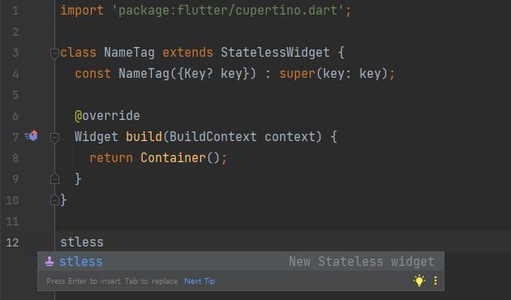

# 파이어베이스 분류 정리

빌드

* Authentication : 회원인증 기능 개발
* App Check
* Firestore Database : NoSQL 이용한 데이터베이스 개발
* Realtime Database
* Extensions
* Storage : 이미지, 영상 등 보관할 저장소
* Hosting
* Functions
* Machine Learning
* Remote Config

무료 제공 용량

