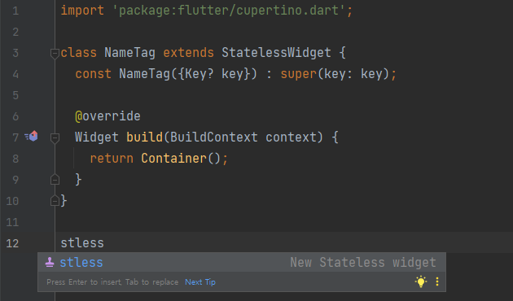

# 스니펫

### 보일러 플레이트


**stless**        <mark style="color:orange;">Stateless</mark> 위젯


<figure><figcaption>
Flutter stless 스니펫
</figcaption></figure>


**stful**        <mark style="color:orange;">Stateful</mark> 위젯


<figure><figcaption>
Flutter stful 위젯
</figcaption></figure>
